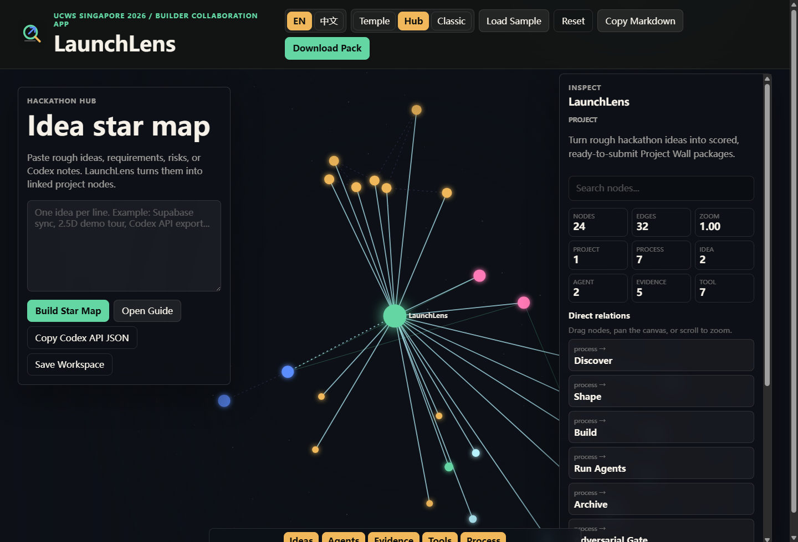

# LaunchLens

> 中文 | [English](#english)

LaunchLens 是面向 **UCWS Singapore Hackathon 2026** 的黑客松项目协作与提交平台。它把项目字段、Demo 证据、GitHub 仓库信号、想法图谱、Agent 输出和最终提交材料组织在同一个可操作工作区里，帮助团队从“项目能跑”推进到“项目能被社区、AI 和专家清楚评审”。



## 在线访问

- GitHub Repository: [https://github.com/wangsiyi7/launchlens](https://github.com/wangsiyi7/launchlens)
- GitHub Pages Demo: [https://wangsiyi7.github.io/launchlens/](https://wangsiyi7.github.io/launchlens/)
- Hub Demo: [https://wangsiyi7.github.io/launchlens/?mode=hub](https://wangsiyi7.github.io/launchlens/?mode=hub)
- Official UCWS Archive: [https://github.com/EpicConnectorAI/UCWS-SINGAPORE-HACKATHON-2026](https://github.com/EpicConnectorAI/UCWS-SINGAPORE-HACKATHON-2026)
- Companion Aggregator Local Demo: [http://127.0.0.1:8082/](http://127.0.0.1:8082/)
- Companion Aggregator Pages Target: [https://wangsiyi7.github.io/ucws-project-aggregator/](https://wangsiyi7.github.io/ucws-project-aggregator/)
- Vercel: 已配置 `vercel.json`，等待账号授权后发布生产链接。

## 核心能力

- **Temple Mode**: 2.5D 空间化流程入口，用六个可点击节点串联项目故事、证据、评分、LLM、归档和最终交接。
- **Hackathon Hub**: 参考 RepoScape 的产品模式，将想法、流程、证据、工具、Agent 和 Codex Bridge 放在一张可拖拽、可缩放、可搜索的星图中。
- **Project Manager**: 本地保存和读取完整工作区快照，包括项目字段、Hub 节点位置、想法、Agent 输出、仓库扫描和生成材料。
- **Agent Studio**: 内置策略、证据、构建、演示、工具、风险和 Re-Forge Gate Agent，用于输出可执行下一步。
- **Codex Bridge**: 导出 `graphOverview`、`selectedNeighborhood` 和 workspace snapshot，方便 Codex、Claude Code、ClaudeCodex 或其他 Agent 读取同一份项目上下文。
- **Evidence Gate**: 审计 Project Wall 所需字段，包括 Demo、GitHub、截图、Logo、团队、技术栈和说明材料。
- **Repo Scanner**: 使用 GitHub 公共 API 检查 README、入口文件、测试/QA 路径、部署配置和近期提交。
- **UCWS Companion Aggregator**: 通过同级 `ucws-project-aggregator` 项目聚合官方 UCWS 仓库、动态项目墙快照、证据规范和 Skill 化流程，并在 Demo 中互相跳转。
- **Optional Supabase Backend**: 静态应用可直接运行，也可用 Supabase 保存跨设备团队工作区。

## 技术栈

- HTML, CSS, JavaScript
- Canvas 2D interactive graph
- localStorage workspace persistence
- GitHub REST API repo evidence scan
- Supabase REST contract for optional backend sync
- OpenAPI contract for Codex/ClaudeCodex interoperability
- GitHub Pages static deployment
- Vercel and Netlify static deployment configs

## 外部参考与合规

LaunchLens 没有复制以下项目源码；它们作为方法论或产品模式参考，并在 `docs/ATTRIBUTION.md` 中保留许可证链接：

- [Akasxh/re-forge](https://github.com/Akasxh/re-forge): 用于多 Agent 对抗校验、证据基底、跨会话记忆和长期演进流程参考。
- [ThomasLix7/RepoScape](https://github.com/ThomasLix7/RepoScape): 用于 Hub 产品模式参考，包括全量节点 HUD、物理/认知关系图、overview/neighborhood 图谱 API 和 Agent 互操作。
- [EpicConnectorAI/UCWS-SINGAPORE-HACKATHON-2026](https://github.com/EpicConnectorAI/UCWS-SINGAPORE-HACKATHON-2026): UCWS Singapore Hackathon 2026 官方项目归档与活动资料来源。

## 本地运行

```powershell
npm.cmd run serve:public-root
```

Open:

```text
http://localhost:8081/
http://localhost:8081/?mode=hub
http://localhost:8081/?lang=zh
```

## 验证

```powershell
npm.cmd test
node tools\validate-submission.mjs
```

## 仓库结构

```text
launchlens/
  index.html                  App shell
  app.js                      UI logic, Hub graph, Agent Bridge, project persistence
  styles.css                  Temple, Hub, Classic, responsive interface styles
  platform-core.js            Pure platform model, agents, graph APIs, Supabase requests
  api/                        OpenAPI contract and Codex workspace examples
  assets/                     Logo, screenshots, social card, generated visual assets
  data/                       Optional UCWS Project Wall sync output
  docs/                       Submission notes, API docs, attribution, deployment runbooks
  supabase/                   Optional workspace table schema
  tests/                      Scoring, evidence, platform, and UCWS sync tests
  tools/                      Local server, payload, GitHub, Vercel, and sync utilities
```

## UCWS 提交材料

- Copy-ready Chinese submission: [PROJECT_WALL_SUBMISSION.zh-CN.md](PROJECT_WALL_SUBMISSION.zh-CN.md)
- Copy-ready English submission: [PROJECT_WALL_SUBMISSION.en.md](PROJECT_WALL_SUBMISSION.en.md)
- Machine-readable payload: [project-payload.json](project-payload.json)
- Final field notes: [docs/PROJECT_WALL_FIELDS.md](docs/PROJECT_WALL_FIELDS.md)

## English

LaunchLens is a hackathon project collaboration and submission platform for **UCWS Singapore Hackathon 2026**. It brings project fields, demo evidence, GitHub repository signals, idea graphs, agent outputs, and final submission materials into one operating workspace so teams can move from “the project runs” to “the project can be understood, inspected, and judged.”

## Live Access

- GitHub Repository: [https://github.com/wangsiyi7/launchlens](https://github.com/wangsiyi7/launchlens)
- GitHub Pages Demo: [https://wangsiyi7.github.io/launchlens/](https://wangsiyi7.github.io/launchlens/)
- Hub Demo: [https://wangsiyi7.github.io/launchlens/?mode=hub](https://wangsiyi7.github.io/launchlens/?mode=hub)
- Official UCWS Archive: [https://github.com/EpicConnectorAI/UCWS-SINGAPORE-HACKATHON-2026](https://github.com/EpicConnectorAI/UCWS-SINGAPORE-HACKATHON-2026)
- Companion Aggregator Local Demo: [http://127.0.0.1:8082/](http://127.0.0.1:8082/)
- Companion Aggregator Pages Target: [https://wangsiyi7.github.io/ucws-project-aggregator/](https://wangsiyi7.github.io/ucws-project-aggregator/)
- Vercel: `vercel.json` is configured; production deployment still needs account authorization.

## Core Features

- **Temple Mode**: a 2.5D spatial workflow for story, evidence, scoring, LLM refinement, archive, and final handoff.
- **Hackathon Hub**: a RepoScape-inspired, draggable, zoomable, searchable star map for ideas, process steps, evidence, tools, agents, and Codex Bridge nodes.
- **Project Manager**: saves and reloads full local workspace snapshots, including Hub coordinates and generated materials.
- **Agent Studio**: focused strategy, evidence, build, demo, tool, risk, and Re-Forge Gate agents.
- **Codex Bridge**: exports `graphOverview`, `selectedNeighborhood`, and workspace snapshots for Codex, Claude Code, ClaudeCodex, and other agent tools.
- **Evidence Gate**: audits Project Wall fields including demo, repo, screenshots, logo, team, tech stack, and notes.
- **Repo Scanner**: checks public GitHub signals such as README, app entry, test/QA path, deployment config, and recent commits.
- **UCWS Companion Aggregator**: a sibling `ucws-project-aggregator` project aggregates the official UCWS repo, dynamic Project Wall snapshot, evidence norms, and Skill workflow, with cross-links from both demos.
- **Optional Supabase Backend**: runs as a static app by default, with optional shared workspace persistence.

## Stack

HTML, CSS, JavaScript, Canvas 2D, localStorage, GitHub REST API, optional Supabase REST, OpenAPI, GitHub Pages, Vercel, and Netlify.

## Run Locally

```powershell
npm.cmd run serve:public-root
```

```text
http://localhost:8081/
http://localhost:8081/?mode=hub
```

## Validate

```powershell
npm.cmd test
node tools\validate-submission.mjs
```
