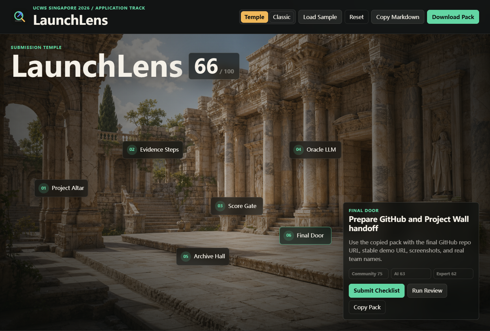

# LaunchLens

> 中文 | [English](#english)

把粗糙的 Hackathon 项目想法、README 草稿和比赛笔记，快速整理成可评分、可复制、可提交的 Project Wall 材料包。

LaunchLens 是为 **UCWS Singapore Hackathon 2026** 准备的浏览器端提交助手。它对齐 Project Wall 字段与比赛评分逻辑，帮助参赛者检查项目完整度、生成提交文案、README、90 秒 pitch、冲刺计划和风险修复清单。



## 项目定位

很多队伍已经做出了可运行产品，但最后一天会卡在“怎么把产品讲清楚”：Demo URL、Repo URL、技术栈、截图、团队成员、项目描述、评委视角、AI 自动评估视角、社区投票视角都要同时兼顾。LaunchLens 解决的是这条最后一公里。

它不是一个静态宣传页，而是一个第一屏即可使用的 App。

## 适配比赛

- 比赛：UCWS Singapore Hackathon 2026
- 赛道：Application
- 评分视角：Community Vote、AI Evaluation、Expert Judges
- 提交字段：项目名、赛道、tagline、description、Demo URL、Repo URL、tech stack、screenshots、logo、team members
- 项目墙限制：最终 Repo URL 应使用 HTTPS GitHub 仓库链接

## 核心功能

- Project Wall 字段体检：检查项目名、赛道、tagline、描述、Demo URL、Repo URL、技术栈、截图和团队成员。
- 三类评分：按社区可读性、AI 可评估性、专家评审价值生成 readiness score。
- 自动生成材料：Submission Pack、README、Pitch、Sprint Plan、Fix List。
- 本地自动保存：使用浏览器 `localStorage` 保存草稿。
- 一键复制和 JSON 导出：方便直接粘贴到 Project Wall。
- 预留大模型 API：内置 Optional LLM 面板，支持 OpenAI-compatible chat completions。
- 已规划 Temple Mode：将提交流程升级为 2.5D 空间化工作流，同时保留 Classic Mode。

## 空间交互方向

LaunchLens 的下一步体验方向是 `Temple Mode + Classic Mode`：

- Temple Mode：空间化提交神殿，用 6 个热点引导项目输入、证据检查、评分、大模型润色、材料整理和最终提交。
- Classic Mode：保留当前双栏工具布局，用于快速填表、生成材料和稳定提交。

空间交互规格见 `SPACE_INTERACTION_SPEC.md`。该规格明确要求 Optional LLM 作为一级节点 `Oracle LLM`，Final Door 保留 GitHub / Project Wall 提交流程，并禁止第一版使用 Three.js 或重写核心逻辑。

## 大模型 API 预留能力

App 里已经预留了大模型增强入口：

- Endpoint：例如 `https://api.openai.com/v1/chat/completions`
- Model：例如 `gpt-4.1-mini`
- API key：用户自己的 key，仅在当前浏览器会话中输入使用

点击 `Optional LLM` 后填写 endpoint、model 和 API key，再点击 `Enhance Current Pack`，即可用大模型润色当前生成的提交材料。

说明：

- 默认不需要后端，不需要构建步骤。
- API key 不写入仓库，也不会被提交到 Git。
- 该入口兼容 OpenAI-style `chat/completions` 请求格式，后续可以接 OpenAI、私有网关或其他兼容服务。

## 快速运行

```powershell
cd "C:\Users\35398\Desktop\UCWS 2026\launchlens"
node tools/serve.mjs
```

打开：

```text
http://localhost:8080/launchlens/
```

临时公网 Demo：

```text
https://volume-obituaries-half-coaches.trycloudflare.com
```

该临时地址只在本地 Cloudflare Quick Tunnel 运行时可用。最终评审建议使用 GitHub Pages、Netlify 或 Vercel。

## GitHub 发布

如果有 GitHub token：

```powershell
cd "C:\Users\35398\Desktop\UCWS 2026\launchlens"
$env:GITHUB_TOKEN="your-github-token"
$env:LAUNCHLENS_TEAM_MEMBERS="Your Name"
node tools/publish-github.mjs launchlens
```

脚本会：

- 创建或复用 `launchlens` GitHub 仓库。
- 生成包含 GitHub Repo URL 和 GitHub Pages URL 的 `project-payload.json`。
- 如果 payload 有变化，自动提交。
- 推送 `main` 分支。

如果已有仓库 remote：

```powershell
node tools/push-github.mjs https://github.com/YOUR_ACCOUNT/launchlens.git
```

## Project Wall 提交

提交前验证 payload：

```powershell
node tools/validate-submission.mjs
```

有 Epic Connector token 时：

```powershell
$env:EPIC_TOKEN="your-epic-token"
node tools/submit-project.mjs
```

GitHub 和 Epic token 都准备好时：

```powershell
$env:GITHUB_TOKEN="your-github-token"
$env:EPIC_TOKEN="your-epic-token"
$env:LAUNCHLENS_TEAM_MEMBERS="Your Name"
node tools/complete-submission.mjs launchlens
```

最终操作请按：

- `FINAL_SUBMISSION_RUNBOOK.md`
- `PROJECT_WALL_FIELDS.md`
- `SUBMISSION.md`

## 资产清单

完整资产索引见 `ASSETS.md`。

关键资产：

- App：`index.html`、`styles.css`、`app.js`
- 截图：`assets/screenshot.png`、`assets/screenshot-mobile.png`
- Logo：`assets/logo.svg`
- 社交图：`assets/social-card.svg`
- 提交材料：`PROJECT_WALL_FIELDS.md`、`SUBMISSION.md`
- 最终执行清单：`FINAL_SUBMISSION_RUNBOOK.md`
- 空间交互规格：`SPACE_INTERACTION_SPEC.md`
- 自动化脚本：`tools/`

## 技术栈

- HTML
- CSS
- JavaScript
- Browser localStorage
- Optional OpenAI-compatible chat completion endpoint
- GitHub Pages workflow
- Netlify/Vercel static deploy config

## English

Turn rough hackathon ideas, README notes, and build context into scored, copy-ready, submission-ready Project Wall packages.

LaunchLens is a browser-based submission copilot built for **UCWS Singapore Hackathon 2026**. It aligns with Project Wall fields and judging criteria, then helps builders review readiness, generate submission copy, draft README content, prepare a 90-second pitch, plan the final sprint, and identify submission risks.

## What It Solves

Many teams can build working software, but lose momentum when they need to explain it clearly for voters, AI evaluation, and expert judges. LaunchLens focuses on that final mile: turning real product work into a credible public submission.

This is a usable app on the first screen, not a marketing landing page.

## Hackathon Fit

- Event: UCWS Singapore Hackathon 2026
- Track: Application
- Evaluation lens: Community Vote, AI Evaluation, Expert Judges
- Submission fields: project name, track, tagline, description, demo URL, repo URL, tech stack, screenshots, logo, team members
- Project Wall constraint: the final repo URL should be an HTTPS GitHub repository link

## Features

- Project Wall field review for required submission fields.
- Readiness scoring across community clarity, AI-evaluable repo quality, and expert-judge product value.
- Generated outputs: Submission Pack, README, Pitch, Sprint Plan, and Fix List.
- Local autosave through browser `localStorage`.
- Copy Markdown and export JSON.
- Reserved LLM API enhancement through an Optional LLM panel.
- Planned Temple Mode: a 2.5D spatial submission workflow while Classic Mode remains available.

## Space Interaction Direction

The next experience direction is `Temple Mode + Classic Mode`:

- Temple Mode: a spatial Submission Temple with six hotspots guiding builders through intake, evidence checks, readiness scoring, LLM refinement, archive outputs, and final submission.
- Classic Mode: the current two-column tool layout for fast editing, generation, and reliable submission.

See `SPACE_INTERACTION_SPEC.md` for the formal spec. It requires Oracle LLM as a first-level node, Final Door for GitHub / Project Wall handoff, and avoids Three.js or rewritten core logic in the first version.

## Reserved LLM API

LaunchLens includes an optional OpenAI-compatible LLM slot:

- Endpoint, for example `https://api.openai.com/v1/chat/completions`
- Model, for example `gpt-4.1-mini`
- API key supplied by the user in the browser

Open `Optional LLM`, enter the endpoint, model, and key, then click `Enhance Current Pack` to improve the current generated output.

Notes:

- No backend is required by default.
- API keys are not committed to the repo.
- The integration follows the OpenAI-style `chat/completions` request shape and can be pointed at compatible providers or private gateways.

## Run Locally

```powershell
cd "C:\Users\35398\Desktop\UCWS 2026\launchlens"
node tools/serve.mjs
```

Open:

```text
http://localhost:8080/launchlens/
```

Temporary public demo:

```text
https://volume-obituaries-half-coaches.trycloudflare.com
```

This temporary URL only works while the local Cloudflare Quick Tunnel is running. Use GitHub Pages, Netlify, or Vercel for final judging.

## Publish To GitHub

With a GitHub token:

```powershell
cd "C:\Users\35398\Desktop\UCWS 2026\launchlens"
$env:GITHUB_TOKEN="your-github-token"
$env:LAUNCHLENS_TEAM_MEMBERS="Your Name"
node tools/publish-github.mjs launchlens
```

The helper creates or reuses the GitHub repo, regenerates the Project Wall payload with GitHub URLs, commits the payload if needed, and pushes `main`.

## Submit

Validate first:

```powershell
node tools/validate-submission.mjs
```

Submit with an Epic Connector token:

```powershell
$env:EPIC_TOKEN="your-epic-token"
node tools/submit-project.mjs
```

For the final handoff, follow `FINAL_SUBMISSION_RUNBOOK.md`.
